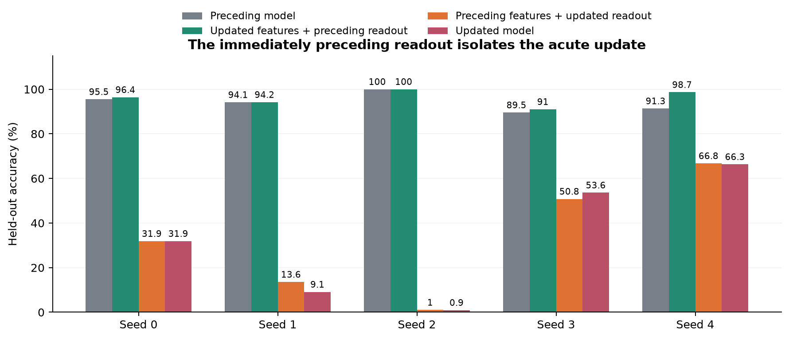
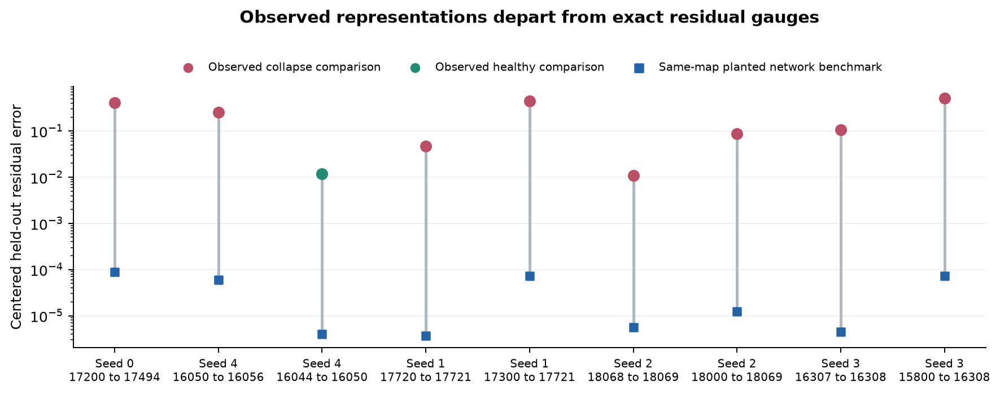
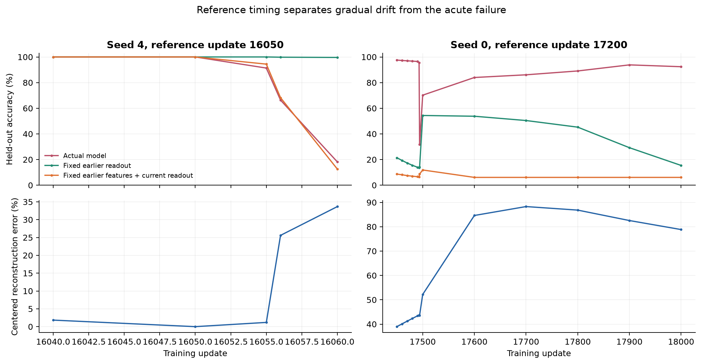
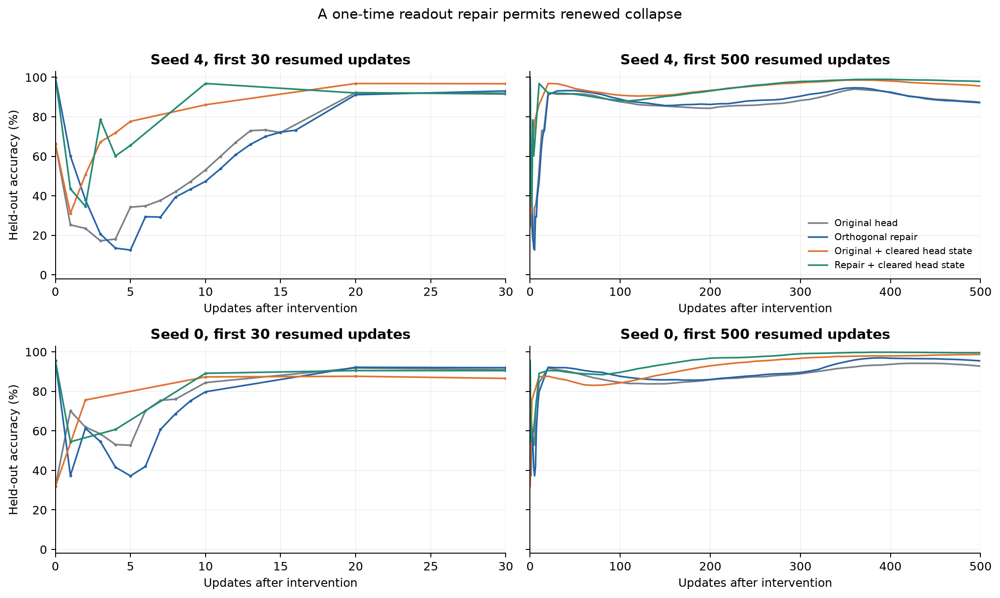
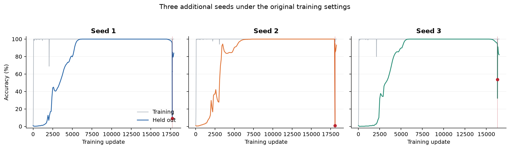

# Testing a pure change-of-basis account of post-grokking collapse

**Historical basis-study report.** The [completed causal study](causal_study/report.md) resolves the numerical-control question left open below and supplies the current [manuscript revisions](causal_study/paper_revision.md).

Completed September 22, 2026. Source repository commit `6d64a981af75f1300d9060109e81552d48a81360`.

The experiments support a sharper conclusion: **the acute failure is dominated by the readout update, substantial linear task information survives, and approximate alignment can repair predictions. A literal pure change of basis does not fit the measured representations.** The success of alignment therefore supports a useful interface description, while the optimizer-level cause of the harmful readout update remains a separate question.

This study adds **52,698 baseline training updates across three fresh seeds**, **9,000 updates across 18 controlled continuations**, and **262 instantaneous head interventions**. All five examined seeds exhibit joint training and test collapse. There are 20 geometry comparisons and 21 bilinear comparisons, including healthy and nearby-reference controls. Multiple snapshots and interventions from one seed are dependent observations.

## 1. The acute update: readout swaps across all five seeds

For each first joint collapse, I retained the checkpoint immediately before the triggering update. The four combinations of preceding/current representations and readouts test component sufficiency and their interaction for that particular update. All entries are held-out accuracy in percent.

| Seed | Preceding model | Updated features + preceding readout | Preceding features + updated readout | Actual collapsed model |
| --- | --- | --- | --- | --- |
| 0 | 95.49 | 96.39 | 31.86 | 31.87 |
| 1 | 94.14 | 94.18 | 13.56 | 9.09 |
| 2 | 99.99 | 100.00 | 1.01 | 0.93 |
| 3 | 89.54 | 91.01 | 50.80 | 53.60 |
| 4 | 91.34 | 98.66 | 66.75 | 66.33 |

The updated representation with the preceding readout preserves or improves the preceding model's accuracy in every seed. The updated readout applied to the preceding representation reproduces most of the collapse. Seed 2 is especially direct: the actual model falls from 99.99% to 0.93%, and restoring its preceding readout recovers **100%** in the actual float32 model. That repair changes the head by only **1.09% of its current norm**. Ten random corrections matched to the orthogonal repair's size remain between 0.88% and 1.01% accuracy.

The table evaluates captured float32 representations with float64 matrix products. Actual float32 head replacements independently reproduce the reported nearby old-head rescues. Seed 3's preceding checkpoint already has 89.54% test accuracy; this analysis attributes the next acute decline, rather than the entire preceding deterioration.

The exact identity

    delta Z = H0 delta W + delta H W0 + delta H delta W

separates the readout, feature, and interaction terms. Across the five adjacent transitions, the readout-term norm is 0.980 to 1.045 times the total class-centered logit change; the feature-term norm is 0.0446 to 0.0839 times that change. The saved reports include every cross term. These norm ratios are descriptive, and should not be interpreted as additive causal percentages.

This identifies the readout update as sufficient for most of the acute loss in these transitions. Earlier coupled representation and optimizer dynamics may still be responsible for producing that update.

## 2. Retained information: a fresh decoder at collapsed checkpoints

Fresh linear heads use only original training examples. Full-dimensional whitening is fitted on the training subset, regularization is selected by an inner training validation split, and the original 8,939 test examples remain held out. Every fresh-seed fit converged.

| Seed | Collapsed update | Native test accuracy | Fresh linear decoder | Fresh decoder at reference |
| --- | --- | --- | --- | --- |
| 0 | 17494 | 31.87 | 98.72 | 99.51 |
| 1 | 17721 | 9.09 | 98.20 | 99.56 |
| 2 | 18069 | 0.93 | 100.00 | 100.00 |
| 3 | 16309 | 32.12 | 98.77 | 99.40 |
| 4 | 16060 | 18.13 | 100.00 | 100.00 |

These are selected collapse snapshots. Seeds 1 and 2 attain their minimum measured follow-up accuracy at the first event; seed 3 reaches its minimum one update later. The seed 4 row uses the previously captured peak, and seed 0 uses its previously captured first joint failure. This is a matched diagnostic at each snapshot, rather than an estimate of the worst possible accuracy over an unlimited run.

The result demonstrates substantial preserved linear task information. The remaining decoder gaps for seeds 0, 1, and 3 leave room for modest loss of linear decodability or limitations of the fitted probe. Complete information preservation is a stronger claim.

## 3. Exact global basis equivalence fails the geometry tests

An exact basis account requires one invertible matrix A with `H1 = H0 A` on the task domain. For full-column-rank matrices this is equivalent to equality of their column spaces. Train-only least squares, affine alternatives, rank sensitivity, principal angles, and a separately labeled full-domain oracle test this restriction.

The following values are centered held-out reconstruction errors, expressed as percentages, for the backward least-squares map from later residuals to earlier residuals. Centering removes training means so the large constant residual component cannot hide changes in input-dependent structure.

| Seed | First-event interval error | Matched-duration healthy error | Immediately preceding update error |
| --- | --- | --- | --- |
| 0 | 43.63 | 32.66 | 1.88 |
| 1 | 43.05 | 10.82 | 4.63 |
| 2 | 9.05 | 2.76 | 1.10 |
| 3 | 45.73 | 14.30 | 10.66 |
| 4 | 25.60 | 1.18 | 25.63 |

All first-event errors exceed the matched-duration healthy controls. Healthy training itself also departs from exact basis equivalence. The intervals span 6, 69, 294, 421, or 508 updates, so their magnitudes should be interpreted within the matched pairs. The nearby one-update comparisons isolate a different question. The healthy controls match interval length and endpoint accuracy, but use earlier optimization stages and can differ in representation norm.

The full-network positive controls deliberately apply exact residual gauges to the actual trained transformer. Eight fixed-condition controls, with condition numbers 1, 3, 10, and 100 in float32 and float64, drop accuracy to 0.60–0.92% when the old readout is retained. Exact compensation and a map inferred from training residuals restore 100% in every case. A further 24 controls plant each observed fitted matrix into its source network, matching its orientation and conditioning. This measures a numerical benchmark for each tested planted transformation.

For the three new adjacent transitions, actual forward-map centered errors are 4.65%, 1.10%, and 10.77%, versus approximately 0.0004–0.0006% for the corresponding exact-network controls. The differences are far larger than the measured numerical floor. Shared-map fits across input, post-attention, and final residual sites also fail the stronger model-wide gauge restriction.

These observations reject a literal exact global change of residual coordinates for the measured pairs. They leave an approximate task-relevant alignment account viable. The mathematical assumptions, exact symmetry construction, and distinctions between the hypotheses are detailed in [mathematical_scope.md](mathematical_scope.md).

## 4. Approximate alignment works, with strong reference-time effects

Train-only orthogonal and general linear transports recover much of the lost accuracy. In the three fresh first events, inverse-GL compensation reaches 95.13%, 100%, and 94.37%. Its corresponding healthy references have 99.19%, 100%, and 99.07% accuracy. The seed 3 peak recovers to 96.16%.

This is stronger than arbitrary perturbation: the norm-matched random controls generally fail to recover the function. It is still insufficient to identify representation rotation as the cause. The linear-map counterfactual `H0 A W1` already contains the harmful updated readout. The simpler identity-map counterfactual `H0 W1` reproduces much of the acute failure by itself.

Reference timing is decisive. Seed 0's old head from update 17200 gives only 14.05% on the collapsed representation, while its head from update 17493 restores 96.39%. Relative to the distant reference, geometry error is already 43.41% at update 17490 and 43.72% at 17493; it is 43.63% at the failed update 17494. The large geometric discrepancy mostly predates that final accuracy collapse.

Maps fitted while excluding output classes transfer successfully across the acute transitions. In the three fresh adjacent comparisons, the penalty relative to matched random training subsets is at most 0.22 percentage points. Longer reference intervals in seeds 1 and 3 produce 10–18 point transfer deficits. Seed 0 shows the same distinction: its four-step comparison transfers well, while its 294-step comparison transfers less well.

Task-only Fourier alignment needs a further identification caveat. The complete output-class Fourier basis produces 113-by-128 coefficient matrices. When both have full row rank, an invertible map between them always exists by nullspace completion. Exact alignment of this projection alone therefore imposes little restriction on the trajectory. The experiments include an explicit counterexample where a task-only map aligns that projection to numerical precision yet achieves only 4.62% on raw held-out features. Labels used for the task projection are explicitly separated from predictive evaluation.

## 5. A one-time repair does not stabilize continued training

The continuation study resumes the seed 0 and seed 4 first failures for 500 updates under nine head/state interventions per seed. Every unmodified optimizer tensor and RNG state is restored exactly. Training accuracy is inspected every update; test accuracy is evaluated every ten updates and whenever training accuracy falls below 90%.

Every successful repair with preserved optimizer states falls below 90% training accuracy on the next update. Clearing the head's Adam state improves eventual recovery but still permits that immediate relapse. After 500 updates, orthogonal repair with preserved state gives 95.47% and 87.14% test accuracy for seeds 0 and 4; clearing the head state gives 99.59% and 97.92%. Native-head controls with cleared state also improve, so recovery cannot be credited entirely to basis compensation.

These branches test the persistence of a one-time intervention. Adam's coordinatewise moments do not generally transform covariantly under a general basis map, so this continuation result cannot by itself reject a gauge-based account of optimizer dynamics. Separate first-moment-only and full-state-reset controls make the intervention semantics explicit.

## Protocol, validation, and scope

Fresh seeds 1, 2, and 3 were specified together before training. Each used the original modulus 113, 30% training split, one-block bias-free transformer with width 128 and MLP width 512, original optimizer groups and hyperparameters, original float32 loss and Muon arithmetic, and a 30,000-update cap. Six consecutive 100-step test evaluations at or above 95% establish grokking. Every subsequent update is checked for training failure; a first joint train/test drop below 90% triggers capture and a 200-update follow-up. All three runs completed that follow-up, at updates 17,921, 18,269, and 16,508.

The expanded monitoring passed an exact model/optimizer/RNG replay check against the original update. Adjacent seed 0 replay also reproduces the saved collapse tensors bitwise. Twenty-eight mathematical and architecture tests pass. All 18 continuation starts, 9,000 requested updates, optimizer counter/reset policies, and final checkpoint accuracies passed the independent audit. All fresh instantaneous interventions passed source-hash, baseline-reproduction, and correction-norm checks.

Matched healthy controls and optimizer-memory controls are explicitly recorded as adaptive additions. The earlier numerical-precision study remains relevant: accurate cross-entropy and double-precision branches avoided the seed 4 collapse over their measured windows. Those are prior results, preserved in [the earlier report](prior_followup_report.md), and should accompany any revision of the paper's numerical-pathology claim.

The evidence concerns five seeds of this specific task and configuration. The 18 continuations concern two selected events. There is no claim of universal behavior across architectures, arithmetic implementations, or longer horizons. The original repository and previous deliverables remain unchanged.

The bundle contains the runnable code, train/test split hashes, raw features, fitted maps and heads, trajectories, selected model/optimizer/RNG checkpoints, protocols, test logs, audits, and a SHA-256 manifest. See [README.md](README.md) for reproduction commands and [paper_revision.md](paper_revision.md) for suggested manuscript wording.
