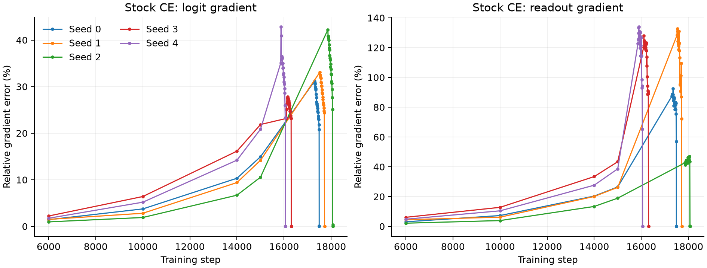
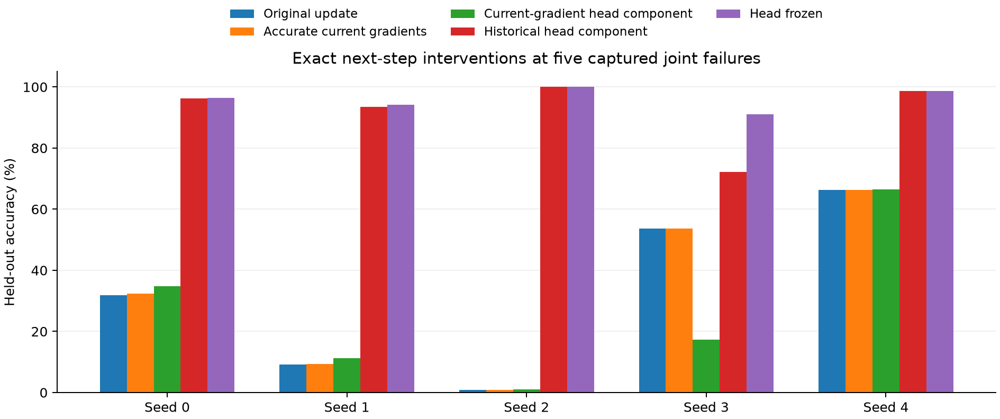
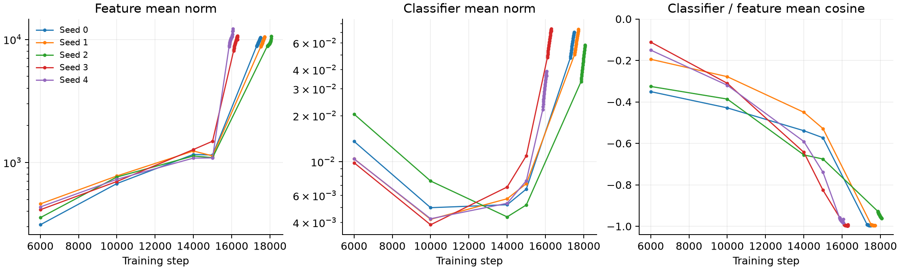
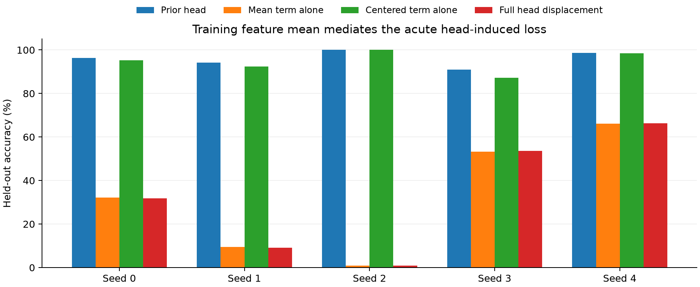

# Five-seed upstream numerical and acute-update diagnostics

This panel establishes growing loss-gradient error before failure and a damaging readout update at each captured acute step. The terminal update is usually dominated by its current-gradient contribution. Long matched training controls remain necessary to determine whether accumulated loss-gradient error causes the sensitive regime.

The panel contains 132 frozen-state measurements, 40 stock/accurate group-gradient interventions, 80 targeted-repair group-gradient interventions, 55 head-state or component interventions, and 40 parameter-group hybrids. Additional panels contain 40 saved-Adam head-gradient variants and 160 fixed-feature step-size evaluations. All five original next updates reproduced every model parameter, optimizer buffer, and RNG value exactly. All five input checkpoint objects remained unchanged. Six new mathematical tests pass.

## Numerical error is measurable well before the event

| Seed | Logit error, step 6000 | Logit error, step 15000 | Readout error, step 15000 | Zero target derivatives, step 15000 |
|---|---:|---:|---:|---:|
| 0 | 1.44% | 14.95% | 26.49% | 2.22% |
| 1 | 1.50% | 14.18% | 26.21% | 2.85% |
| 2 | 0.97% | 10.56% | 18.95% | 0.55% |
| 3 | 2.23% | 21.86% | 43.42% | 10.63% |
| 4 | 1.75% | 20.86% | 38.64% | 7.15% |

The reference uses exactly the same stored float32 logits, evaluates the derivative in float64 with an accurate target entry, then casts that derivative to float32 for backpropagation through the original float32 network. This isolates loss arithmetic. The step-6000 checkpoint already contains measurable gradient error, so a matched continuation from it is an early intervention within an existing trajectory.

## Correcting the last gradient is too late

| Seed | Preceding accuracy | Original next update | Accurate current gradients | Head frozen |
|---|---:|---:|---:|---:|
| 0 | 95.49% | 31.87% | 32.45% | 96.39% |
| 1 | 94.14% | 9.09% | 9.29% | 94.18% |
| 2 | 99.99% | 0.93% | 0.93% | 100.00% |
| 3 | 89.54% | 53.60% | 53.60% | 91.01% |
| 4 | 91.34% | 66.33% | 66.33% | 98.66% |

Replacing current gradients by accurate derivatives fails to avert all five terminal events. This also holds for the targeted repair that preserves stock wrong-class derivatives and reconstructs only the correct-class derivative. Removing only the shared-class gradient is a weaker correction and leaves most of the derivative error intact. These terminal results address the already-developed state, and do not test the consequences of correcting earlier updates.

The exact class-centered part of each captured head displacement reproduces its accuracy collapse. Applying only its class-common part retains the head-freeze accuracy. This is consistent with classification depending on logit differences. A common-class numerical error can still influence earlier representation learning and optimizer state.

## Which part of Adam creates the terminal displacement?

The Adam numerator is decomposed into its decayed historical first moment and its current-gradient contribution, using the same original denominator for both. Component norms are not additive causal percentages. Applying each component separately is an evaluation-only counterfactual.

| Seed | Current-gradient component | Historical component | Current norm / total norm | Historical norm / total norm |
|---|---:|---:|---:|---:|
| 0 | 34.79% | 96.16% | 1.028 | 0.109 |
| 1 | 11.18% | 93.52% | 0.988 | 0.064 |
| 2 | 1.03% | 100.00% | 0.984 | 0.190 |
| 3 | 17.40% | 72.13% | 0.734 | 0.912 |
| 4 | 66.42% | 98.67% | 1.000 | 0.004 |

The current-gradient component is damaging in every seed. Historical first-moment memory by itself retains at least 93.52% held-out accuracy in four seeds. Seed 3 is already below 90% held-out immediately before the event and has substantial opposing contributions from both terms. Resetting first-moment memory and clearing all head state are separate interventions in the raw results; neither consistently repairs the event. The denominator-fixed decomposition is essential because zeroing a gradient also changes Adam’s second-moment update.

## Readout overshoot is directly measurable

With preceding features fixed, the accurate training-loss derivative along the captured head displacement is negative in all five seeds. Nevertheless the full step sharply increases training loss. The predeclared scale grid was −1, −0.1, 0, 0.0001, 0.0003, 0.001, 0.003, 0.01, 0.03, 0.1, 0.3, 0.5, 0.75, 1, 1.5, and 2. Selection minimizes training loss over the nonnegative scales, with held-out accuracy measured only afterward. This chooses 0.1 in four seeds and 0.01 in seed 3. With following features fixed, the best scales are 0.03, 0.03, 0.1, 0, and 0.1 for seeds 0 through 4. Their held-out accuracies are 96.52%, 94.50%, 100%, 91.01%, and 98.29%. This is direct evidence that the acute head displacement overshoots along its own direction in the preceding fixed-feature problem.

These curves use float64 multiplication of stored float32 features and head weights. The previous and following native network metrics are retained separately. Simultaneous feature changes matter: in seed 3 the same head direction increases training loss immediately when evaluated with the following features.

## The complete parameter update is locally descending

A separate check uses the entire actual parameter displacement across hidden weights, embeddings, and readout. The accurate training gradient has a negative dot product with this complete displacement in every seed. All fifteen individual group contributions are also negative. Training loss decreases at both 0.001 and 0.01 times the full displacement in every event, and increases sharply at the full step. Both interpolation endpoints exactly reproduce the captured parameter tensors. Thus the observed acute steps combine a local descent direction with finite-step overshoot. An explanation based on those complete updates pointing uphill is contradicted by these five measurements. See `joint_direction.md` for the full training-only grid and group contributions.

## Adam converts common-class gradient error into discriminating updates

At step 15000, 76.74–84.96% of the stock-versus-reference head-gradient error norm lies in the class-common component. Injecting only that component into the reference gradient, while preserving the saved Adam state, produces an update difference with 45.85–73.37% of its norm in the class-centered component. The linear SGD control has centered fractions around 3e-16. At the immediate-pre-event checkpoints, the corresponding Adam centered fractions are 45.89–96.46%. The primary calculation evaluates Adam in float64 using the exact saved state; separate realized float32 updates are retained in `adam_common.json`.

This is a local causal demonstration of how a gradient error that is common across classes can become a class-discriminating update through elementwise adaptive scaling. It does not establish that this component alone accounts for the complete accumulated trajectory. The common and centered fractions above refer to vector norms and are not additive percentages.

## Compatibility with published numerical feature inflation

The original trajectories also exhibit the mean-growth signature described by [Liu Hanqing et al., Grokking or Glitching? How Low-Precision Drives Slingshot Loss Spikes (2026)](https://arxiv.org/html/2605.06152v2): classifier and feature means grow and become nearly antiparallel. The paper derives this mechanism under specific geometric and optimization assumptions. Our measurements test its compatibility with split Muon/AdamW and weight decay.

| Seed | Feature mean norm, 15000 | Feature mean norm, pre-event | Pre-event mean cosine | Feature global-mean power | Within/between centered energy |
|---|---:|---:|---:|---:|---:|
| 0 | 1,146.4 | 10,374.4 | -0.9967 | 98.17% | 4.21 |
| 1 | 1,128.7 | 10,526.8 | -0.9967 | 97.89% | 5.76 |
| 2 | 1,092.8 | 10,597.7 | -0.9613 | 99.39% | 1.04 |
| 3 | 1,486.3 | 10,471.3 | -0.9934 | 97.31% | 5.85 |
| 4 | 1,086.9 | 12,203.0 | -0.9815 | 99.58% | 1.01 |

All means in the table use the complete modular grid, giving exact class balance. Training-example and balanced-training-class means are also recorded. The within/between centered energy ratios remain 1.01–5.85 immediately before the events, so ideal within-class feature collapse is not established. These measurements support compatibility with the published mechanism and motivate the targeted numerical intervention; they do not transfer the prior theorem automatically to this optimizer and task configuration.

## The inflated feature mean mediates the acute logit change

Using the following residuals H1 and the actual head displacement dW, the logit change splits exactly into (H1 − mu) dW + mu dW, where mu is calculated from training examples only. Starting from H1 W0, adding the mean term alone closely reproduces each accuracy collapse. Adding the centered-feature term alone retains much of the previous-readout performance. This is an evaluation-only mediation; it makes no claim about subsequent training or a changed architecture.

| Seed | Following features / prior head | Mean term alone | Centered term alone | Full displacement |
|---|---:|---:|---:|---:|
| 0 | 96.39% | 32.11% | 95.26% | 31.87% |
| 1 | 94.18% | 9.42% | 92.48% | 9.09% |
| 2 | 100.00% | 0.93% | 100.00% | 0.93% |
| 3 | 91.01% | 53.34% | 87.20% | 53.60% |
| 4 | 98.66% | 66.07% | 98.46% | 66.33% |

The component reconstruction errors are below 3e-16 in relative L2 norm. The same training mean is applied to held-out examples. The mean term is an input-independent vector of class-logit changes, so an inflated feature mean can turn a class-discriminating readout displacement into a large shared class bias. In seed 2, the mean term sends 99.955% of held-out examples to class 64, matching the full displacement; the centered term alone preserves 100% accuracy. Predicted-class histograms are retained for every arm. This directly connects the observed mean inflation to the captured acute failure.

## What this resolves

The acute failure is causally localized to a class-discriminating head update and is compatible with overshoot in a sensitive representation/readout state. Current-gradient roundoff at the terminal step and historical first-moment momentum alone provide incomplete explanations. The substantial earlier derivative errors make numerical dependence a concrete hypothesis with a measurable intervention, and the separate long continuation panel is needed to adjudicate it. Exact residual gauge symmetry and approximate basis alignment do not supply this causal chain on their own.

Protocols: `../diagnostics_protocol.md`, `../diagnostics_stepsize_protocol.md`, `../diagnostics_adam_common_protocol.md`, `../diagnostics_mean_drift_protocol.md`, and `../diagnostics_mean_mediation_protocol.md`. Raw measurements: each `seed*/timecourse.json`, `event.json`, `targeted.json`, `stepsize.json`, `adam_common.json`, `mean_drift.json`, and `mean_mediation.json`. Machine-readable summary: `summary.json`, `events.csv`, `gradient_timecourse.csv`, and `mean_drift.csv`. Reusable matched-checkpoint diagnostic: `../diagnostics_branch_compare.py`.

## Matched step-20000 intervention endpoints

All twenty fixed checkpoints verify step 20000 and retain input hashes. Original-stock endpoints have recovered high accuracy after their captured failures. Each corrected endpoint has 100% held-out accuracy. The dense trajectory results determine whether an intervention prevents failures during the interval.

| Training backward rule | Held-out accuracy | Feature mean norm | Head mean norm | Mean cosine | Global mean feature power |
|---|---:|---:|---:|---:|---:|
| stock32 | 99.91–100.00% | 620.61–923.12 | 0.01746–0.04307 | -0.850–-0.372 | 54.92–67.07% |
| accurate32 | 100.00–100.00% | 415.77–725.60 | 0.00548–0.00811 | -0.233–-0.097 | 16.75–41.90% |
| target_repair | 100.00–100.00% | 419.51–722.78 | 0.00549–0.00811 | -0.225–-0.099 | 16.93–41.65% |
| row_projection | 100.00–100.00% | 125.37–386.30 | 0.00527–0.00788 | -0.122–0.132 | 3.06–20.09% |

At these matched endpoints, the actual accurate-CE and targeted-repair derivatives match the same-logit reference within 3.2e-7 relative L2 error. The actual projected derivative retains 52.94–86.07% relative error, while its per-example zero-sum residual is only 1.4e-8–2.1e-8 relative to the reference gradient norm. This separates restoration of the zero-sum invariant from complete derivative accuracy. Hypothetical stock-CE errors at those same corrected states are reported in separate columns in the detailed panel and were not the gradients used during corrected training.

After recovery, the stock endpoint derivative errors are smaller than their pre-event values; its feature means still carry 54.92–67.07% of feature power, compared with 16.75–41.90% for accurate/targeted continuations and 3.06–20.09% for projection. These are downstream state differences and do not identify a unique mediator of all earlier updates.

Detailed results: `matched_specificity_final.md`, `matched_stock20000.md`, and the corresponding JSON/CSV files. Five earlier-intervention step-30000 endpoints are reported in `matched_accurate_final.md`; all five have 100% train and held-out accuracy at that endpoint.
